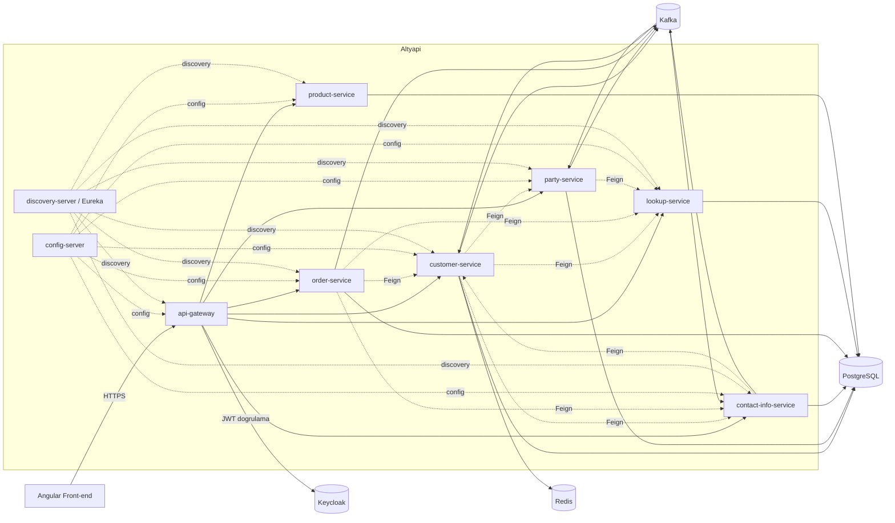

# Akademi-11-Pair4-CRM

Mikroservis mimarisiyle geliştirilen bir CRM (Customer Relationship Management)
sistemi. Bir satış temsilcisinin müşteri (customer) onboard etmesi, adres/iletişim
bilgisi yönetmesi, sipariş (order) oluşturması ve bunların arka planda birbirine
event tabanlı senkron kalması üzerine kurulu.

Bu dosya projenin genel resmini ve nasıl ayağa kaldırılacağını anlatır. Ortam
profilleri, Feign/outbox/Debezium gibi back-end'e özgü detaylar için
**[back-end/README.md](back-end/README.md)**'ye bakın. Front-end (Angular) için
**[front-end/README.md](front-end/README.md)**.

## Projeyi Ayağa Kaldırma

Gereken tek şey **Docker Desktop** veya **Podman** (+ `podman compose` için bir
compose sağlayıcısı — `docker-compose` kurulu değilse `pip install podman-compose`).
`infra/run/` altındaki script'ler hangisi kuruluysa (Docker önceliklidir) otomatik
onu kullanır — elle seçim yapmaya gerek yok.

Tüm altyapı, `docker-compose.yml` ve başlatma/durdurma script'leri **tek bir yerde**,
`infra/` klasöründe yaşar (front-end'i de kapsadığı ve back-end'e özgü olmadığı için
`back-end/` içinde değil, repo kökünde):

```
infra/
├── docker-compose.yml
├── postgres-init/ , keycloak/ , debezium/    # altyapı config/data dosyaları
└── run/
    ├── dev/    start.bat / stop.bat   # altyapı container'da, servisler native (vendored Maven ile)
    ├── test/   start.bat / stop.bat   # tüm stack container'da, SPRING_PROFILE=test
    └── prod/   start.bat / stop.bat   # tüm stack container'da, SPRING_PROFILE=prod
```

```bat
infra\run\dev\start.bat
rem veya: infra\run\test\start.bat / infra\run\prod\start.bat
```

- **`dev`**: Postgres/Kafka/Redis/Keycloak container'da başlar, her Spring Boot
  servisi ise kendi Windows Terminal tab'ında **native** çalışır (vendored Apache
  Maven ile — `mvnw` değil, bkz. back-end/README.md). En hızlı iterasyon için.
- **`test`/`prod`**: Front-end dahil her şey (`--build` ile) container'da,
  ilgili Spring profiliyle ayağa kalkar.

Durdurmak için aynı klasördeki `stop.bat`:
- `stop.bat` → sadece o ortamda başlattıklarını durdurur
- `stop.bat infra` (yalnızca dev) → altyapı container'larını da kapatır
- `stop.bat clean` (yalnızca test/prod) → Postgres/Kafka veri volume'lerini de siler

Ayağa kalktıktan sonra kontrol:

| Adres | Ne | Not |
|---|---|---|
| http://localhost:8761 | Eureka dashboard | Tüm servisler `UP` görünmeli |
| http://localhost:8080/swagger-ui.html | API Gateway / merkezi Swagger UI | |
| http://localhost:4200 | Front-end (Angular) | Sadece test/prod (container) |
| http://localhost:8180 | Keycloak | admin/admin |
| http://localhost:8888 | Config Server | `/<servis-adi>/prod` ile config sorgulanabilir |
| http://localhost:8090 | Kafka UI | Topic/mesaj izleme |
| http://localhost:8083/connectors | Debezium Connect REST API | |
| http://localhost:8081 | Redis Commander | |
| localhost:5432 | PostgreSQL | `crm` / `crm` |

**Not:** `customer/party/contact-info/order/lookup/product-service`'in artık
sabit bir host portu yok — her biri rastgele bir portta ayağa kalkar ve bunu
Eureka'ya kendisi bildirir (`server.port: 0` + `eureka.instance.prefer-ip-address`).
Servisler birbirine zaten Eureka/Feign üzerinden ulaştığı için bu bir sorun
değil; sadece host'tan (Postman/curl ile) doğrudan tek bir servise değil, ya
Gateway'e (`:8080`) ya da container loglarından (`podman logs <container>` /
`docker logs <container>`) o an hangi porta bağlandığına bakarak ulaşman gerekir.

## Mimari



- Tüm dış istekler **api-gateway** üzerinden geçer (Keycloak JWT doğrulaması burada yapılır).
- Servisler birbirini **Eureka** üzerinden bulur, ayarlarını **Config Server**'dan
  (ayrı bir git deposundan — bkz. aşağıdaki not) çeker.
- Servisler arası senkron çağrılar **Feign** ile (timeout + circuit breaker +
  sadece-GET retry korumalı, bkz. back-end/README.md), asenkron veri senkronu ise
  **outbox pattern + Debezium + Kafka** ile yapılır.

## Servisler

| Servis | Sorumluluk | Event (outbox/Kafka) | Senkron cagri (Feign) |
|---|---|---|---|
| `api-gateway` | Tek giriş noktası, JWT doğrulama, routing, merkezi Swagger UI aggregation | - | - |
| `config-server` | Tüm servislerin merkezi konfigürasyonunu ayrı bir git deposundan sunar | - | - |
| `discovery-server` | Eureka service registry | - | - |
| `customer-service` | Müşteri agregatı: onboarding, adres/hesap (billing account) yönetimi, cache (Redis+Caffeine) | ✅ yayınlar + dinler | party, contact-info, lookup |
| `party-service` | Kişi (individual/party role) verisi, national ID doğrulama | ✅ yayınlar + dinler | lookup |
| `contact-info-service` | Adres ve iletişim bilgisi (contact medium) | ✅ yayınlar + dinler | customer, lookup |
| `order-service` | Sipariş/sepet, business interaction spec | ✅ yayınlar (dinlemiyor) | customer, contact-info, lookup |
| `lookup-service` | Referans veri (genel tip/durum/type-value) — CRUD, event yok | REST-only | - |
| `product-service` | Ürün katalog/kampanya/teklif — CRUD, event yok | REST-only | - |
| `shared-contracts` | Servisler arası ortak DTO/contract'lar + ortak hata/Feign altyapısı (bkz. back-end/README.md) | kütüphane | kütüphane |
| `shared-events` | Ortak outbox/inbox altyapısı + event sınıfları | kütüphane | kütüphane |

## Teknolojiler

- **Backend:** Java 21/25, Spring Boot 3.5.x, Spring Cloud 2025.0.x, PostgreSQL 16,
  Kafka 4 (KRaft) + Debezium 3.1 (outbox→CDC), Redis 7, Keycloak 26, Resilience4j
- **Front-end:** Angular
- **Altyapı:** Docker veya Podman Compose (bkz. yukarıdaki "Projeyi Ayağa Kaldırma").

## Bilinen sınırlamalar

- `postgres-init`de `billing_db` ve `notification_db` için veritabanı oluşturuluyor
  ama karşılık gelen bir `billing-service`/`notification-service` henüz yok — ya
  planlanan bir sonraki adım ya da temizlenmesi gereken artık.
- Swagger UI aggregation (`api-gateway`) şu an sadece customer/contact-info/lookup
  servislerini kapsıyor; party/order/product eklenmedi.
