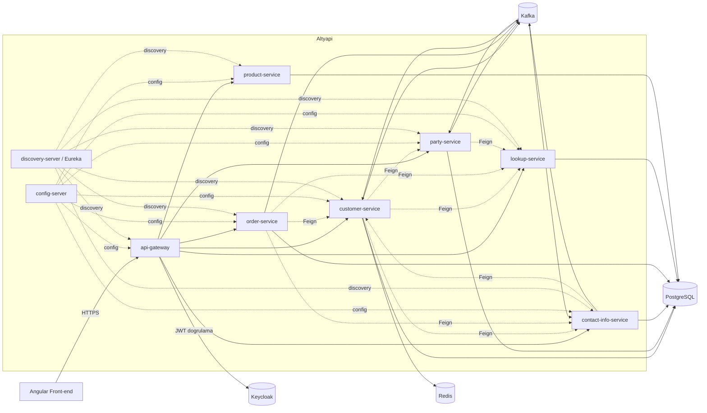

# Akademi-11-Pair4-CRM

Mikroservis mimarisiyle geliştirilen bir CRM (Customer Relationship Management)
sistemi. Bir satış temsilcisinin müşteri (customer) onboard etmesi, adres/iletişim
bilgisi yönetmesi, sipariş (order) oluşturması ve bunların arka planda birbirine
event tabanlı senkron kalması üzerine kurulu.

Bu dosya projenin genel resmini anlatır. Servislerin nasıl ayağa kaldırılacağı,
ortam profilleri, outbox/Debezium detayları için **[back-end/README.md](back-end/README.md)**'ye bakın.
Front-end (Angular) için **[front-end/README.md](front-end/README.md)**.

## Mimari

- Tüm dış istekler **api-gateway** üzerinden geçer (Keycloak JWT doğrulaması burada yapılır).
- Servisler birbirini **Eureka** üzerinden bulur, ayarlarını **Config Server**'dan
  (ayrı bir git deposundan — bkz. aşağıdaki not) çeker.
- Servisler arası senkron çağrılar **Feign** ile (timeout + circuit breaker +
  sadece-GET retry korumalı, bkz. back-end/README.md), asenkron veri senkronu ise
  **outbox pattern + Debezium + Kafka** ile yapılır.

## Servisler

| Servis | Sorumluluk | Event (outbox/Kafka) | Senkron cagri (Feign) |
|---|---|---|---|
| `api-gateway` | Tek giriş noktası, JWT doğrulama, routing, merkezi Swagger UI aggregation | - | - |
| `config-server` | Tüm servislerin merkezi konfigürasyonunu ayrı bir git deposundan sunar | - | - |
| `discovery-server` | Eureka service registry | - | - |
| `customer-service` | Müşteri agregatı: onboarding, adres/hesap (billing account) yönetimi, cache (Redis+Caffeine) | ✅ yayınlar + dinler | party, contact-info, lookup |
| `party-service` | Kişi (individual/party role) verisi, national ID doğrulama | ✅ yayınlar + dinler | lookup |
| `contact-info-service` | Adres ve iletişim bilgisi (contact medium) | ✅ yayınlar + dinler | customer, lookup |
| `order-service` | Sipariş/sepet, business interaction spec | ✅ yayınlar (dinlemiyor) | customer, contact-info, lookup |
| `lookup-service` | Referans veri (genel tip/durum/type-value) — CRUD, event yok | REST-only | - |
| `product-service` | Ürün katalog/kampanya/teklif — CRUD, event yok | REST-only | - |
| `shared-contracts` | Servisler arası ortak DTO/contract'lar + ortak hata/Feign altyapısı (bkz. back-end/README.md) | kütüphane | kütüphane |
| `shared-events` | Ortak outbox/inbox altyapısı + event sınıfları | kütüphane | kütüphane |

## Teknolojiler

- **Backend:** Java 21/25, Spring Boot 3.5.x, Spring Cloud 2025.0.x, PostgreSQL 16,
  Kafka 4 (KRaft) + Debezium 3.1 (outbox→CDC), Redis 7, Keycloak 26, Resilience4j
- **Front-end:** Angular
- **Altyapı:** Podman Compose (`back-end/infra/`)

## Bilinen sınırlamalar

- `postgres-init`de `billing_db` ve `notification_db` için veritabanı oluşturuluyor
  ama karşılık gelen bir `billing-service`/`notification-service` henüz yok — ya
  planlanan bir sonraki adım ya da temizlenmesi gereken artık.
- Swagger UI aggregation (`api-gateway`) şu an sadece customer/contact-info/lookup
  servislerini kapsıyor; party/order/product eklenmedi.
